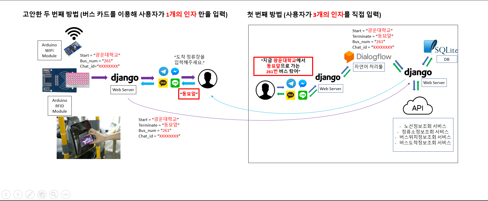
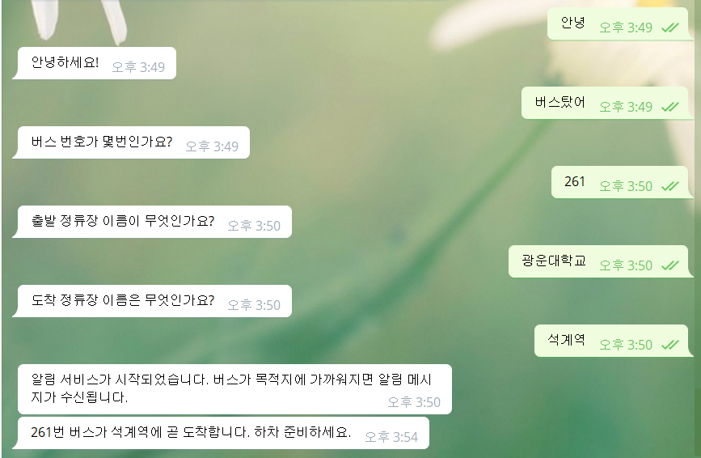

## Lanfriend

### 지금 Telegram에서 @busalarmbot (버스알림봇)을 검색해 보세요.

대중교통(버스)을 이용하는 사용자에게 하차할 정류장이 가까워졌을 때 예약메시지와 알림으로 하차 정보를 제공해주는 **메신저 기반 인공지능 챗봇**

+ 자연스럽게 대화를 건네주세요.

```sh
# 예시

- 버스 탔어
- 광운대학교에서 버스 탔어
- 261번 버스 탔어

```

+ 챗봇의 응답에 따르되 정확한 버스 번호와 정류장 이름을 입력해주세요.

```sh
# 예시

- 261 (O)
- 261번 (O)

- 광운대 (X)
- 광운대학교 (O)

- 동대문역 (X)
- 동대문역.흥인지문 (O)
```

+ 사용자가 정확한 값을 입력했다면, 챗봇은 알림 서비스를 시작한다는 메시지와 함께 대화를 종료합니다.

```sh
# 예시

알림 서비스가 시작되었습니다.
버스가 목적지에 가까워지면 알림 메시지가 수신됩니다.

```

+ 버스가 도착 전 정류장을 지나면 알림 메시지를 보냅니다.

```sh
# 예시

261번 버스가 광운대학교에 곧 도착합니다.
하차 준비하세요.
```

---

> 광운대학교 컴퓨터소프트웨어학과 강승연<br>
> 광운대학교 소프트웨어학부 윤홍찬, 김광호<br>

----------------------------------------



  시스템 구상도
<br>

  시연 이미지
<br>
<br>
시연 동영상 : https://www.youtube.com/watch?v=g4C23xnZVHU&list=PLwRlPsmXEcgLsdvv-YPri6oIYVtOEVDjH&index=2&t=13s 
<br>
개발 기간 : 2019-08-13 ~ 2019-09-18 (1개월 6일)  <br>
개발 인원 : 3명(개발자 3)  <br>
사용 도구: Python, Django, Telegram, Dialogflow <br>
