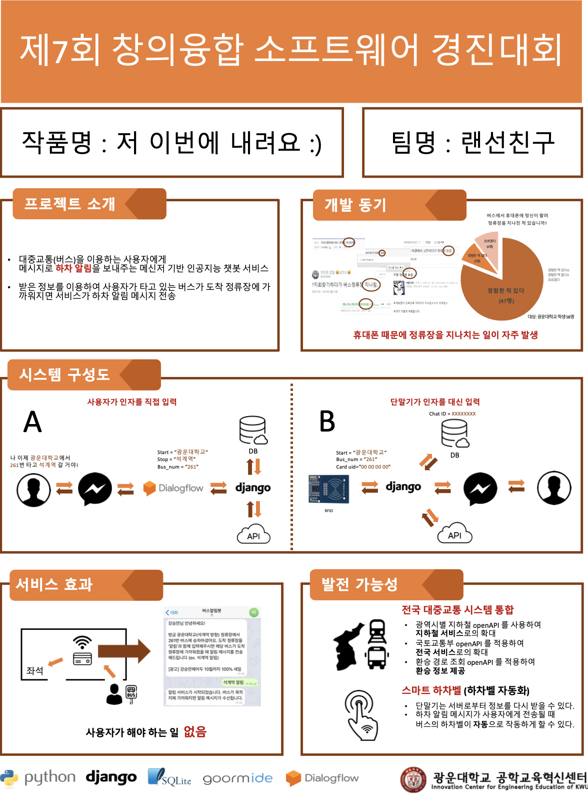

## Lanfriend (랜선친구)

[](http://hits.dwyl.io/FKgk/The-bus-stop-alert)

### 지금 Telegram에서 @busalarmbot (버스알림봇)을 검색해 보세요.

대중교통(버스)을 이용하는 사용자에게 하차할 정류장이 가까워졌을 때 예약메시지와 알림으로 하차 정보를 제공해주는 **메신저 기반 인공지능 챗봇**

+ 자연스럽게 대화를 건네주세요.

```sh
# 예시

- 버스 탔어
- 광운대학교에서 버스 탔어
- 261번 버스 탔어

```

+ 챗봇의 응답에 따르되 정확한 버스 번호와 정류장 이름을 입력해주세요.

```sh
# 예시

- 261 (O)
- 261번 (O)

- 광운대 (X)
- 광운대학교 (O)

- 동대문역 (X)
- 동대문역.흥인지문 (O)
```

+ 사용자가 정확한 값을 입력했다면, 챗봇은 알림 서비스를 시작한다는 메시지와 함께 대화를 종료합니다.

```sh
# 예시

알림 서비스가 시작되었습니다.
버스가 목적지에 가까워지면 알림 메시지가 수신됩니다.

```

+ 버스가 도착 전 정류장을 지나면 알림 메시지를 보냅니다.

```sh
# 예시

261번 버스가 광운대학교에 곧 도착합니다.
하차 준비하세요.
```

---

> 광운대학교 컴퓨터소프트웨어학과 강승연<br>
> 광운대학교 소프트웨어학부 윤홍찬, 김광호<br>

----------------------------------------


## Bus Get-off Notification ChatBot (버스 하차 알림 챗봇) 

&nbsp;&nbsp;&nbsp;&nbsp;&nbsp;&nbsp;&nbsp;&nbsp;&nbsp;&nbsp;&nbsp;&nbsp;&nbsp;&nbsp;&nbsp;&nbsp;&nbsp;&nbsp;&nbsp;&nbsp;&nbsp;&nbsp;&nbsp;&nbsp;&nbsp;&nbsp;&nbsp;&nbsp;&nbsp;&nbsp;&nbsp;&nbsp;&nbsp;&nbsp;&nbsp;&nbsp;&nbsp;&nbsp;&nbsp;&nbsp;&nbsp;&nbsp;&nbsp;&nbsp;&nbsp;&nbsp;&nbsp;&nbsp;&nbsp;&nbsp;&nbsp;&nbsp;&nbsp;&nbsp;&nbsp;&nbsp;&nbsp;&nbsp;&nbsp;&nbsp;*2018 창의융합 SW 경진대회 우수상 수상*

**“버스를 이용하는 사용자에게 하차할 정류장이 가까워졌을 때 예약 메시지와 알림으로 하차 정보를 제공해 주는 메신저 기반 인공지능 Chat Bot – 저 이번에 내려요”**

다른 곳에 정신이 팔려 정류장을 지나친 적이 있는 모든 현대인들에게 하차할 정류장을 놓칠 걱정거리를 덜어줄 수 있는 인공지능 Chat Bot 을 개발하였는데, 이를 메신저 플랫폼을 통해 서비스를 제공함으로써 접근성과 효용성을 제고하였다.

<br>

- **구현한 기능 소개**
  - 사용자의 정보를 저장 및 관리
  - 탑승지, 버스 번호, 도착지를 입력하면 정류장에 도착 전 알림 메시지 전송
  - 유효하지 않은 값을 입력하면 다시 입력받도록 함

<br>

- **사용한 언어 및 도구, 라이브러리**
  + Python3
  + Django
  + SQLite
  + Open API (노선 정보 조회 서비스, 정류소 정보 조회 서비스, 버스 위치 정보 조회 서비스)
  + Google Dialogflow
  + Telegram API

<br>

+ **개발 환경**
  + macOS High Sierra / Windows 10
  + goorm IDE

<br>

- **프로젝트 구성원 및 개발 기간**

  + 광운대학교 소프트웨어학부 윤홍찬, 김광호

  + 광운대학교 컴퓨터소프트웨어학과 강승연

  + 2018.8.13 ~ 9.18

    

- **시연 동영상**
  + https://www.youtube.com/watch?v=g4C23xnZVHU&list=PLwRlPsmXEcgLsdvv-YPri6oIYVtOEVDjH&index=2&t=13s 

<br>

- **스크린샷**

<br></img>
<br>

 

시연 이미지 (Telegram 캡처 화면)


<br>

---

> 2019.11.6 최종 업데이트
>
> 광운대학교 소프트웨어학부 윤홍찬
